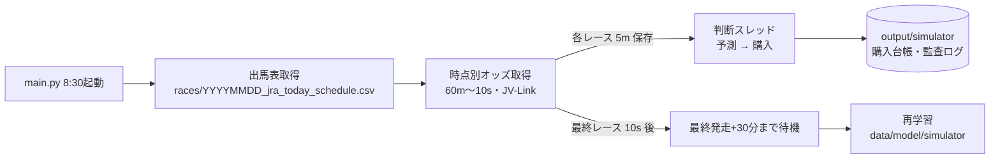

# KeibaAI

JRA のレース当日に、次の4つを1本のプログラム（`main.py`）で行います。

1. 当日の発走時刻を取得する
2. 発走時刻に合わせて JRA-VAN（JV-Link）から単勝・複勝・枠連のオッズと票数を取得する
3. 各レースの発走5分前のオッズで勝率を予測し、購入ルールに従って即PATで馬券を買う
4. 全レース終了後にモデルを再学習する

> **IMPORTANT**
> 予測条件（`docs/report/pool_filter_condition_spec.md`）は 1分前オッズで検証された調査結果を、判断時点を5分前に前倒しして使っています。**5分前での成績は未検証**で、的中率が低く払戻の振れ幅が大きい戦略です。実購入（live）の前に、必ず paper / dry-run で動作と成績を確認してください。

---

## 目次

1. [1日の流れ](#1-1日の流れ)
2. [セットアップ](#2-セットアップ)
3. [日次実行（main.py）](#3-日次実行mainpy)
4. [出力ファイル](#4-出力ファイル)
5. [個別実行](#5-個別実行)
6. [コード構成](#6-コード構成)
7. [予測モデルと購入ルール](#7-予測モデルと購入ルール)
8. [購入の安全装置](#8-購入の安全装置)
9. [制約・注意点](#9-制約注意点)
10. [トラブルシューティング](#10-トラブルシューティング)
11. [テスト](#11-テスト)

---

## 1. 1日の流れ

最初のレースが 10:05、最終レースが 16:25 の日の例です。

| 時刻 | 処理 | 担当モジュール |
| --- | --- | --- |
| 08:30 | `main.py` 起動（タスクスケジューラ） | `main.py` |
| 08:30 | JRA 出馬表から全競馬場・全レースの発走時刻を取得し CSV 保存 | `src/scraping/_jra_today_schedule.py` |
| 09:05〜 | 各レースの **60m・30m・10m・5m・4m・3m・2m・1m・10s 前**に JV-Link からオッズ・票数を取得し、レース別 CSV に追記 | `src/scraping/realtime_odds.py` |
| 各レースの 5分前 | 5m の保存が終わったレースを判断スレッドへ渡し、10m・5m から特徴量を作成 → 勝率予測 → EV・Kelly で買い目と金額を決定 → 安全審査 → 即PATで購入 | `src/pipeline/daily.py` → `src/simulator/` → `src/buying/` |
| 16:24:50 | 最終レースの 10s 前の取得で、オッズ取得が終了 | |
| 16:55 | 最終レース発走 + 30分で再学習し、モデルを更新（次の開催日から使われる） | `src/simulator/retrain.py` |



- オッズ取得（JV-Link）はメインスレッド、予測・購入は別スレッドで動きます。購入のブラウザ操作に時間がかかっても、他レースのオッズ取得は止まりません。
- 5分前のオッズは「発走5分前の時刻までに JRA-VAN が発表した最新値」です。保存は5分前の約2秒後に完了し、購入の送信期限（既定: 発走2分前）までの約3分で予測と購入を行います。

---

## 2. セットアップ

### 2.1 動作環境

- Windows（JV-Link は Windows 専用の COM コンポーネント）
- JRA-VAN データラボ会員登録と JV-Link のインストール・利用設定
- Python 3.11〜3.13
- 即PAT の会員登録（購入する場合）

### 2.2 インストール

```powershell
cd C:\Users\<ユーザー>\デスクトップ\src\KeibaAI_Main
python -m venv .venv
.venv\Scripts\python.exe -m pip install -r requirement.txt
.venv\Scripts\python.exe -m playwright install chromium
```

### 2.3 設定ファイル

| ファイル | 内容 | 用意の仕方 |
| --- | --- | --- |
| `config/config.yaml` | データ・モデルの場所、賭け金計算、再学習期間 | 同梱。必要に応じて編集 |
| `config/features.json` | 特徴量定義（本システムでは空で可） | 同梱 |
| `src/buying/.env` | 即PAT の認証情報、購入モード、金額上限、締切 | `env.example` をコピーして編集。**リポジトリに登録しない** |

`config/config.yaml` の主な項目:

```yaml
pipeline:
  model_filename: simulator/win_pool_filter.txt
  retrain_start_period: '202401'   # 再学習に使う最初の年月（終わりは実行日の月）
  retrain_delay_minutes: 30        # 最終レース発走から再学習を始めるまでの分数
evaluation:
  kelly_fraction: 0.1              # fractional Kelly
  initial_bankroll: 100000         # Kelly の基準資金（円）
  max_bet: 5000                    # 1点あたりの上限（円）
  max_bets_per_race_win: 3         # 1レースの最大点数
```

`src/buying/.env` の主な項目（詳細は `env.example` と `src/buying/README.md`）:

| キー | 意味 | 初期値 |
| --- | --- | --- |
| `JRA_INET_ID` / `JRA_KANYUSHA_NO` / `JRA_PIN` / `JRA_PARS_NO` | 即PAT の認証情報 | 要設定 |
| `BUYING_MODE` | `paper`（画面操作なし）/ `dry-run`（確認画面まで操作して取消）/ `live`（実購入） | `dry-run` |
| `BUYING_KILL_SWITCH` | `true` の間は一切購入しない | `true` |
| `BUYING_MAX_BET_YEN` / `_RACE_YEN` / `_DAY_YEN` / `_SESSION_YEN` | 1点・1レース・1日・1回の購入処理あたりの上限（円）。超えるとレースごと見送り | すべて 100 |
| `BUYING_MAX_BETS_PER_RACE` | 1レースの最大点数。超えるとレースごと見送り | 1 |
| `BUYING_SUBMIT_DEADLINE_LEAD_SECONDS` | 発走何秒前を送信期限とするか | 120 |
| `BUYING_MAX_ODDS_AGE_SECONDS` | 判断に使うオッズの鮮度上限（秒） | 180 |

### 2.4 必要なデータ

| データ | 場所 | 用途 | 作り方 |
| --- | --- | --- | --- |
| 学習済みモデル | `data/model/simulator/win_pool_filter.txt`、`_calibrator.pkl`、`_simulator.json` | 当日の予測 | `python main.py --retrain-only`（下の2つが必要） |
| 月別締切前オッズ | `data/processed/odds_series/YYYYMM_odds_series_tansho.csv` | 再学習の特徴量 | **本リポジトリ外**（`odds_series_scraper`） |
| 着順 | `data/processed/horses/*_horses.csv` | 再学習のラベル | **本リポジトリ外** |

月別締切前オッズには `race_id, date, umaban, odds_win_10m, hyosu_total_10m, odds_win_5m, hyosu_total_5m` の列が、着順には `race_id, horse_number, finish_position` の列が必要です。

モデルが無い日は、`main.py` は予測・購入を行わずに、オッズ取得と再学習だけを行います（ログに ERROR が出ます）。

### 2.5 タスクスケジューラへの登録

開催日の 8:30 に `scripts/run_daily.bat` を起動するよう登録します。

```powershell
schtasks /Create /TN "KeibaAI Daily" /SC WEEKLY /D SAT,SUN /ST 08:30 `
  /TR "\"C:\Users\<ユーザー>\デスクトップ\src\KeibaAI_Main\scripts\run_daily.bat\""
```

- 祝日開催（月曜など）は別途トリガーを追加してください。開催の無い日に起動すると、出馬表が取れず終了コード 1 で終了します。
- JV-Link の COM やブラウザ操作が必要なため、最初は「ユーザーがログオンしている場合のみ実行」で登録してください。
- PC がスリープしないよう電源設定を確認してください。
- 引数を付ける場合: `/TR "\"...\run_daily.bat\" --paper"`

---

## 3. 日次実行（main.py）

```powershell
.venv\Scripts\python.exe main.py            # .env の BUYING_MODE に従って購入
.venv\Scripts\python.exe main.py --paper    # ブラウザを開かずに購入判定と台帳記録だけ行う
.venv\Scripts\python.exe main.py --no-buy   # 予測 CSV の出力まで（購入処理を呼ばない）
.venv\Scripts\python.exe main.py --live     # BUYING_MODE=live のときの実購入（明示が必須）
.venv\Scripts\python.exe main.py --retrain-only   # 再学習だけすぐに実行
```

| オプション | 意味 |
| --- | --- |
| `--no-buy` / `--paper` / `--live` | 購入の扱い（同時指定不可）。指定なしは `.env` の `BUYING_MODE`。`BUYING_MODE=live` なのに `--live` が無い場合は起動時に停止する |
| `--no-retrain` / `--retrain-only` | 再学習をしない / 再学習だけ行う |
| `--retrain-start-period YYYYMM` | 再学習の開始年月（既定: `config.yaml` の値） |
| `--retrain-delay-minutes N` | 最終レース発走から再学習までの分数（既定: 30） |
| `--min-ev X` | EV しきい値（既定: モデルと一緒に保存された値。通常 1.10） |
| `--model-filename PATH` | `data/model` 配下のモデルファイル名 |
| `--include-past` | 起動が遅れて過ぎた取得時点を、JV-Link の時系列オッズから復元する |
| `--headed` | 出馬表取得用ブラウザを表示する |
| `--config` / `--env` | 設定ファイルの場所 |

**停止**: `Ctrl+C` でオッズ取得を止めると、処理中・判断待ちのレースの予測と購入を終えてから終了します。再学習は行いません。もう一度 `Ctrl+C` を押すと、購入の途中でも強制終了します。その場合は `python -m src.buying.cli reconcile` で成立状況を確認してください。

**終了コード**:

| コード | 意味 |
| --- | --- |
| 0 | 正常終了 |
| 1 | 起動時の設定エラー、出馬表の取得失敗、予測・購入・再学習のいずれかでエラー（日次レポートの `errors` を確認） |
| 2 | 成立不明の購入がある（`python -m src.buying.cli reconcile` で即PATと照合） |
| 130 | `Ctrl+C` で中断 |

---

## 4. 出力ファイル

| パス | 内容 | 作成元 |
| --- | --- | --- |
| `data/processed/schedules/YYYYMMDD_jra_today_schedule.csv` | **当日のレース予定**（race_id・rt_key・競馬場・レース番号・発走時刻） | 出馬表取得 |
| `data/processed/realtime_odds/YYYYMMDD/{race_id}_tansho_realtimeodds.csv` | 単勝オッズ・票数（60m〜10s の全時点。`snapshot_label` 列で区別） | オッズ取得 |
| `data/processed/realtime_odds/YYYYMMDD/{race_id}_fukusho_realtimeodds.csv` | 複勝 | オッズ取得 |
| `data/processed/realtime_odds/YYYYMMDD/{race_id}_wakuren_realtimeodds.csv` | 枠連 | オッズ取得 |
| `data/processed/realtime_odds/YYYYMMDD/YYYYMMDD_scheduler_events.csv` | 各取得時点の**実行記録**（取得時刻・鮮度・状態）。購入時の安全審査にも使う | オッズ取得 |
| `output/simulator/YYYYMMDD_all.csv` | 全馬の予測（予測確率・5mオッズ・EV・賭け金・見送り理由） | 予測 |
| `output/simulator/YYYYMMDD_bets.csv` | 推奨買い目だけ | 予測 |
| `data/processed/buying/buying_ledger.sqlite3` | 購入台帳（同じ買い目の二重購入を防ぐ） | 購入 |
| `data/processed/buying/logs/YYYYMMDD_buying.jsonl` | 購入の監査ログ（安全審査で見送った理由を含む。認証情報はマスク） | 購入 |
| `data/model/simulator/win_pool_filter.txt` ほか2ファイル | 学習済みモデル・確率校正器・運用パラメータ | 再学習 |
| `output/pipeline/YYYYMMDD_pipeline_report.json` | 日次レポート（レース数、レースごとの予測・購入結果、再学習結果、エラー） | main.py |
| `logs/pipeline/YYYYMMDD_pipeline.log` | 日次の実行ログ（画面に出る内容と同じ） | main.py |

> レース予定は `YYYYMMDD_jra_today_schedule.csv` です。`YYYYMMDD_scheduler_events.csv` はレース予定ではなく、オッズ取得の実行記録です。

オッズ CSV の主な列: `race_id`, `umaban`（枠連は `kumiban`）, `snapshot_label`, `target_datetime`（基準時刻）, `happyo_datetime`（JRA-VAN の発表時刻）, `odds_win`（単勝）/ `odds_place_min`・`odds_place_max`（複勝）/ `odds_wakuren`（枠連）, `hyosu_total`（その券種のレース全体の票数合計・100円単位）, `ninkijun`, `source_age_seconds`。JV-Link の O1 レコードには馬ごとの票数が無いため、馬ごとの投票額は予測時に `0.8 × hyosu_total ÷ odds_win` で逆算しています。列の詳細は `docs/manual/scraper_manual.md` を参照してください。

---

## 5. 個別実行

`main.py` を使わずに、各段階を単独で実行できます。

```powershell
# オッズ取得だけ（当日、最終レースまで動き続ける）
.venv\Scripts\python.exe -m src.scraping.realtime_odds

# 取得済みオッズで当日の全レースを予測（10m・5m が揃ったレースが対象）
.venv\Scripts\python.exe -m src.simulator.predict_today --date 2026-09-20

# 再学習
.venv\Scripts\python.exe -m src.simulator.retrain --start-period 202401 --end-period 202609

# 購入システムの診断・購入計画の検証・成立不明の確認
.venv\Scripts\python.exe -m src.buying.cli doctor
.venv\Scripts\python.exe -m src.buying.cli paper --date 2026-09-20 --bets-csv output\simulator\20260920_bets.csv
.venv\Scripts\python.exe -m src.buying.cli reconcile
```

---

## 6. コード構成

```text
KeibaAI_Main/
├── main.py                      日次実行の入口（引数解析・ログ設定）
├── scripts/run_daily.bat        タスクスケジューラ用の起動バッチ
├── config/
│   ├── config.yaml              データ・モデル・賭け金・日次実行の設定
│   └── features.json            特徴量定義（本システムでは空）
├── env.example                  src/buying/.env のひな型
├── requirement.txt              依存パッケージ
├── src/
│   ├── pipeline/                ── 日次パイプライン
│   │   └── daily.py             [1]〜[4] の実行、判断スレッド、日次レポート
│   ├── scraping/                ── データ取得
│   │   ├── realtime_odds.py     発走時刻に合わせた時点別オッズ取得スケジューラ（公開CLI）
│   │   ├── _jra_today_schedule.py  JRA 出馬表（Playwright）から発走時刻・rt_key を取得
│   │   ├── _jvlink_o1.py        JV-Link 速報オッズ O1 レコードの取得・解析
│   │   └── _netkeiba_today_fetcher.py  未使用（参照先モジュールが無く import できない）
│   ├── simulator/               ── 予測と再学習
│   │   ├── features.py          特徴量 odds_5m / inc_share_10m_5m とレース選別列 pool_5m の定義
│   │   ├── realtime_loader.py   当日のレース別オッズ CSV から 10m・5m を読む
│   │   ├── predict_today.py     予測 → レース選別 → EV → Kelly で買い目と金額を決める
│   │   ├── retrain.py           過去データで LightGBM を再学習し、しきい値と一緒に保存
│   │   ├── artifacts.py         モデルと運用パラメータ（しきい値・特徴量列）の保存・検証
│   │   ├── odds_series_loader.py  学習用の月別締切前オッズの読込・票数逆算
│   │   └── dataset.py           着順（学習ラベル）の読込
│   ├── buying/                  ── 即PAT 自動購入（詳細は src/buying/README.md）
│   │   ├── strategy.py          予測結果を購入指示（BetIntent）へ変換
│   │   ├── risk.py              購入前の安全審査（締切・金額上限・オッズ鮮度・5m 証跡）
│   │   ├── service.py           安全審査 → 台帳予約 → 画面操作 → 結果記録
│   │   ├── browser/             Playwright による即PAT 画面操作
│   │   ├── ledger.py            SQLite 購入台帳（冪等性・二重購入防止）
│   │   ├── snapshot_reader.py   レース予定と取得記録を購入用の型に変換
│   │   ├── config.py            .env の読込と検証
│   │   ├── audit.py / clock.py / domain.py / process_lock.py  監査ログ・時刻・型・多重起動防止
│   │   └── cli.py               購入システム単体の CLI（doctor / paper / reconcile 等）
│   ├── models/                  ── LightGBM 学習・予測・評価の共通ライブラリ
│   │   ├── model_creator.py     学習・校正・予測・保存の窓口（simulator から利用）
│   │   ├── trainer.py           LightGBM 学習・確率校正・保存の実装
│   │   ├── evaluation.py        評価指標と Kelly 賭け金計算
│   │   └── その他               本体パイプライン用（スタッキング、馬連・三連複、CV 等）。日次実行では import のみ
│   └── cli_common.py            設定ファイル読込などの共通処理
├── data/
│   ├── processed/schedules/     当日のレース予定
│   ├── processed/realtime_odds/ 当日オッズ（日付フォルダ）
│   ├── processed/odds_series/   学習用の月別締切前オッズ（外部で用意）
│   ├── processed/horses/        着順（外部で用意）
│   ├── processed/buying/        購入台帳・監査ログ
│   └── model/simulator/         学習済みモデル
├── output/                      予測結果・日次レポート
├── logs/                        実行ログ
├── docs/                        仕様書・実装レポート・取得マニュアル
└── tests/                       単体テスト
```

---

## 7. 予測モデルと購入ルール

| 項目 | 内容 |
| --- | --- |
| 特徴量（2列） | `odds_5m`（5分前の単勝オッズ）、`inc_share_10m_5m`（10分前→5分前に入った資金のうち、その馬が占める割合） |
| モデル | LightGBM 二値分類（1着か否か）＋ isotonic 確率校正。木は小さく固定（`num_leaves=15`, `max_depth=4`） |
| レース選別 | 5分前のレース総投票額 `pool_5m` が、学習期間の上位25%のしきい値（q0.75）未満のレースは見送る |
| 買う馬 | `EV = 予測確率 × 5分前オッズ ≥ 1.10` |
| 賭け金 | fractional Kelly（`kelly_fraction=0.1`、基準資金 10万円、1点上限 5,000円）を100円単位に切り捨て。1レース最大3点 |
| 実際の上限 | `.env` の `BUYING_MAX_*` を超える買い目を含むレースは、**減額せずにレースごと見送る**。初期値（1点100円・1レース1点）のままだと、Kelly で100円を超える金額や2点以上の推奨が出たレースは購入されない |

- レース選別のしきい値は再学習時に学習期間の分布から決めて保存し、当日の値では決め直しません（未来の情報を使わないため）。
- 特徴量の定義を変えると、保存済みモデルとの不一致を検出して予測を停止します。その場合は再学習してください。

---

## 8. 購入の安全装置

`main.py` の購入はすべて `src/buying` の安全装置を通ります。

- **モード**: `paper` → `dry-run` → `live` の順に確認してください。live は `BUYING_MODE=live` と `--live` の両方が必要です。
- **kill switch**: `BUYING_KILL_SWITCH=true` の間は購入せず、判定と記録だけ行います（初期値 true）。
- **安全審査（RiskGate）**: 送信期限（発走2分前）より前であること、金額・点数が上限以内であること、5分前オッズの証跡（`snapshot_label=5m`、基準時刻が発走5分前、状態 `saved`、鮮度180秒以内）を確認し、1つでも満たさないレースは購入しません。上限を超えた場合も減額はせず、レースごと見送ります。
- **確認画面の照合**: 即PAT の確認画面に表示された合計金額が購入指示と一致しない場合は送信しません。
- **二重購入防止**: 購入台帳の一意キーで、同じレース・同じ買い目を二度送信しません。
- **成立不明の扱い**: 送信後に結果が確認できない場合は「成立不明」として記録し、自動で再送しません（終了コード 2）。
- **多重起動防止**: 同じアカウントの購入処理は1プロセスだけ実行できます。

---

## 9. 制約・注意点

- **再学習に当日の結果は自動では入りません。** 学習データ（`data/processed/odds_series`、`data/processed/horses`）を更新する処理は本リポジトリに無いため、17時前後の自動再学習は、その時点で置かれている学習データで学習し直します。当日分を学習に含めるには、学習データを更新してから `python main.py --retrain-only` を実行してください。学習データの最終日が当日より前の場合は、その旨がログに WARNING で出ます。
- **5分前判断の成績は未検証**です（冒頭の注意を参照）。
- **PC の時計**: 取得・購入の判定は PC の時刻（日本時間）で行います。Windows の時刻同期を有効にしてください。
- **実行中に CSV を Excel で開かない**: Excel が開いたファイルは書き込めなくなり、取得に失敗します。
- **起動の遅れ**: 起動時点で過ぎた取得時点は既定でスキップします（`skipped_at_startup` として記録）。`--include-past` で復元できますが、時系列オッズは5〜10分程度の粒度なので、5分前の厳密な値にはなりません。
- **ブラウザ操作**: 即PAT の画面変更、メンテナンス、追加認証があると購入は失敗します（見送りとして記録されます）。
- `src/scraping/_netkeiba_today_fetcher.py` は参照先のモジュールが無く、import できません（どこからも使われていません）。

---

## 10. トラブルシューティング

| 症状 | 確認すること |
| --- | --- |
| `起動できませんでした: 認証情報が未設定です` | `src/buying/.env` の作成。購入しない場合は `--no-buy` か `--paper` |
| `BUYING_MODE=live の実購入には --live の指定が必要です` | 意図した live なら `--live` を付ける |
| `モデルが使えないため…` | `data/model/simulator/` のモデル3ファイル。特徴量が変わった場合は `--retrain-only` で作り直す |
| `本日の開催が無いか、出馬表を取得できませんでした` | 開催日か、JRA サイトに接続できるか。`--headed` で画面を確認 |
| 予測が `10m と 5m のオッズが1行も対応しませんでした` | `realtime_odds/YYYYMMDD/YYYYMMDD_scheduler_events.csv` の該当レースの `status`（`jvlink_unavailable` なら JV-Link の状態） |
| 購入されない | `data/processed/buying/logs/YYYYMMDD_buying.jsonl` の `race_rejected` の `reasons`（`kill_switch`、`submit_deadline_expired`、`odds_stale`、`max_*` 等） |
| 終了コード 2 | `python -m src.buying.cli reconcile` を実行し、即PAT の投票内容照会と照合 |
| 再学習の失敗 | `data/processed/odds_series` と `data/processed/horses` の有無・期間、`config.yaml` の `retrain_start_period`。失敗しても既存モデルは残る |

---

## 11. テスト

```powershell
.venv\Scripts\python.exe -m unittest discover -s tests
```

JV-Link・即PAT・JRA サイトにはアクセスせず、モックと一時フォルダで動作を確認します。
