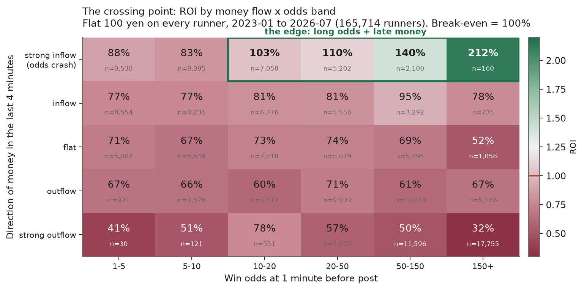
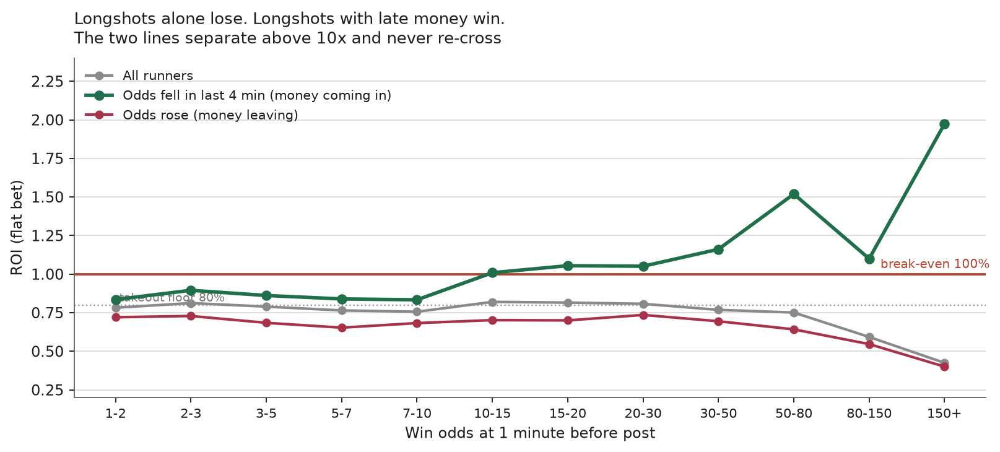
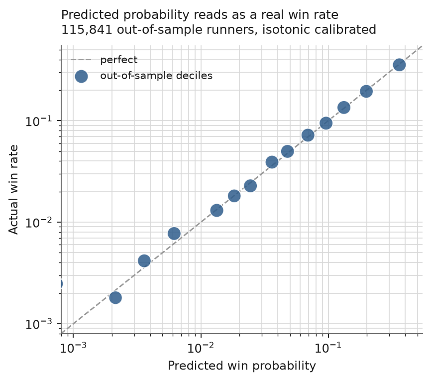
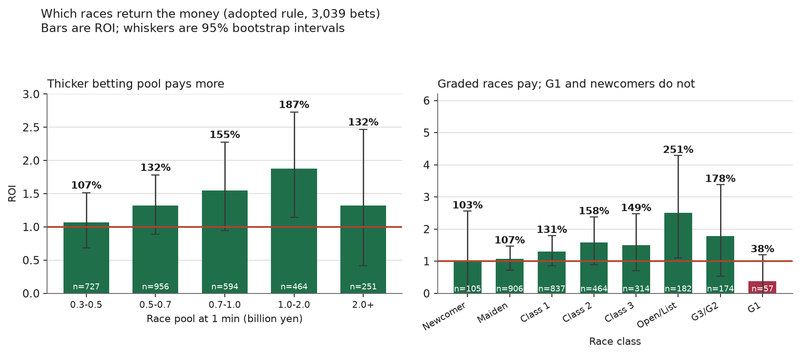
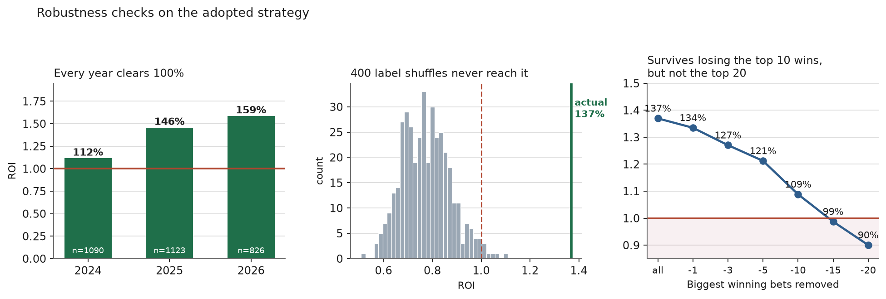
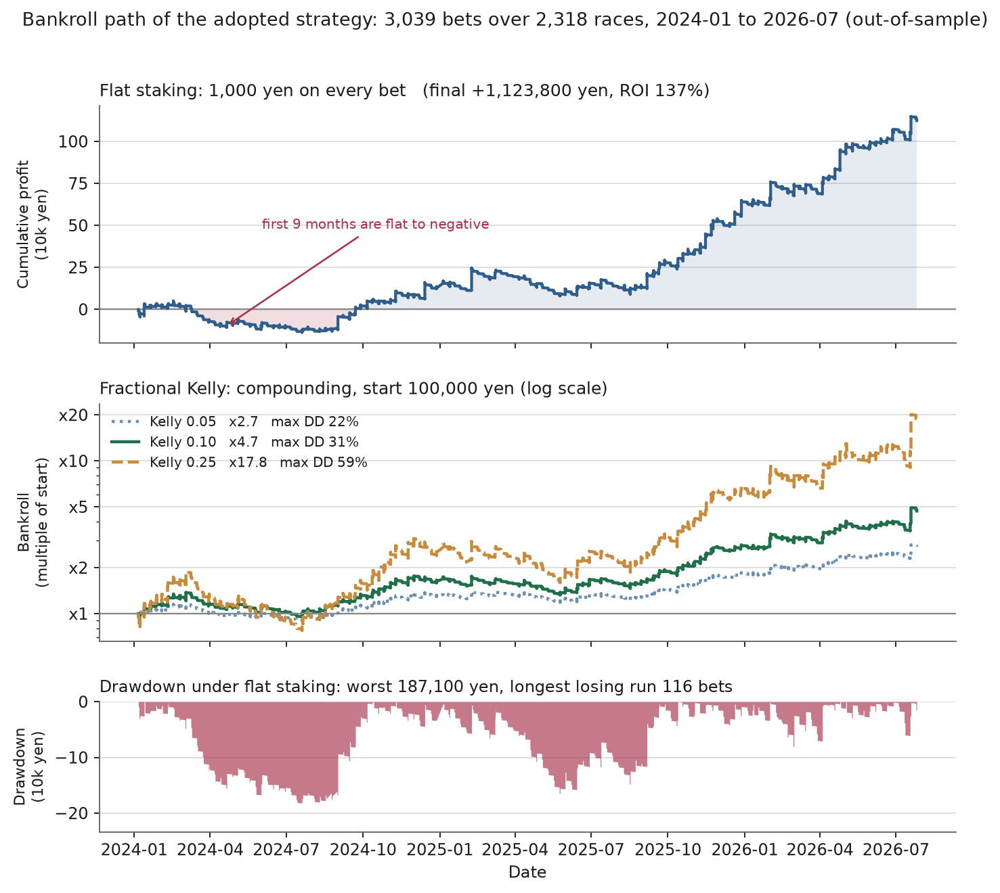

# 穴馬戦略レポート: 締切直前の資金流入で「高オッズ × 高勝率」を捉える

作成日: 2026-09-30
対象: 単勝 / 検証期間 2024-01-06 〜 2026-07-26（8,340レース・アウトオブサンプル）
結論: **回収率 136.98%（95%CI [109.3, 161.4]）/ 的中率 5.10% / 平均オッズ 40.4倍**

実装: `src/backtest/anaba/`（`dataset.py` / `features.py` / `walkforward.py` / `strategy.py`）
テスト: `test/test_anaba_strategy.py`

---

## 0. 要点

| 問い | 答え |
|---|---|
| 穴場の**馬**は？ | **締切直前4分でオッズが下がった、市場8〜9番人気・10〜150倍の馬**。これが戦略の本体（§4） |
| 穴場の**レース**は？ | **投票が厚いレース**（1m時点7億円以上で162%、7億円未満は118%）。**格付け戦**（191%）。**新馬・未勝利は避ける**（103〜107%）。**G1は最悪（38%）**（§5） |
| 100%を超えるか？ | **超える。** 5シード全て・3年全てで100%超。ラベルシャッフル400回で p < 0.0025（§6） |
| なぜ勝てるのか？ | 締切直前に入る「賢い金」は当たるが、**パリミュチュエルの配当は締切時点の全体票で決まる**ため、その情報が価格に十分反映されない（§1） |
| 落とし穴は？ | **122点の連続不的中**、最大18.7万円のドローダウン、最初の9ヶ月はマイナス圏（§8） |

> **IMPORTANT: この戦略の唯一の情報源は市場である。**
> 馬の能力・血統・調教・騎手成績は一切使っていない。
> 「他の賭け手が直前に何を買ったか」だけを見ている。

---

## 1. 市場の構造: どこに歪みがあるか

### 1.1 単純な穴狙いは最悪の戦略

全馬に機械的に100円賭けたときの回収率（2023-01〜2026-07 / 165,714頭）。
JRA単勝の控除率は20%なので、何もしなければ回収率は80%に張り付く。

| 確定オッズ帯 | 頭数 | 勝率 | 回収率 |
|---|---|---|---|
| 〜1.5倍 | 900 | 62.2% | 84.3% |
| 3〜5倍 | 14,474 | 20.3% | 80.2% |
| 10〜15倍 | 14,239 | 6.9% | 83.5% |
| 15〜20倍 | 10,921 | 4.9% | 84.9% |
| 30〜50倍 | 17,516 | 2.0% | 76.7% |
| 80〜150倍 | 18,220 | 0.57% | 59.9% |
| 150倍超 | 25,324 | 0.19% | **41.8%** |

150倍超の馬を買い続けると資金は半分以下になる。
超高オッズ帯は他の賭け手が買いすぎており、期待値が大きく負に沈んでいる。
**「オッズが高い馬」を探すだけでは絶対に勝てない。高オッズの中から勝つ馬を選別する軸が要る。**

### 1.2 その軸は「締切直前の資金の向き」

`5m`（発走5分前）から `1m`（1分前）へのオッズ変化
`drift = log(odds_1m / odds_5m)` で全馬を5分割し、1m時点のオッズ帯と交差させる。



**右上の一角だけが控除率を突破している。**
「高オッズ」と「直前に金が入った」の**交差点**であり、どちらか一方では届かない。

同じことを線で見ると、境目が10倍にあることが分かる。



- **灰色（全馬）は一度も100%に届かない。**
- **緑（オッズが下がった馬）は10倍を境に100%を超え、以降は二度と下に戻らない。**
- **赤（オッズが上がった馬）はどのオッズ帯でも負ける。**

この図が採用ルールの根拠である。オッズ下限を10倍にしたのは緑線が100%を超える点だからで、
150倍で切ったのはその先でサンプルが薄くなり分散が跳ね上がるためである。

### 1.3 なぜ最後の4分間なのか

実測では、**最後の4分間（5m→1m）にレース全体のプールが2.3倍になる**。
10m→5m の区間に入る資金はその1/4しかない。
単勝の投票は締切直前に集中するので、**そこに入る金が最も情報を持っている**。

> **NOTE: 2022年以前のデータは使えない**
> `1m` スナップショットが実質的に更新されるのは 2023年以降。
> 2016〜2021年は 98%のレースで `5m` と `1m` の総票数が同一であり、
> この区間の特徴量は算出できない。本検証を2023年以降に限定した理由である。

---

## 2. データと検証条件

### 2.1 データ

| 項目 | 値 |
|---|---|
| 構築期間 | 2023-01-05 〜 2026-07-26 |
| 全行数 / レース数 | 165,714行 / 11,931レース |
| 特徴量が揃う行 | 160,598行 / 11,568レース（欠損は補完せず除外） |
| **検証（OOS）** | **115,841行 / 8,340レース**（2024-01-06〜2026-07-26） |

| ソース | 用途 |
|---|---|
| `data/processed/odds_series/*_tansho.csv` | 60m/30m/10m/5m/1m のオッズ・総票数 |
| `data/processed/horses/*_horses.csv` | 着順（ラベル） |
| `data/processed/payouts/*_payouts.csv` | 確定払戻（決済） |
| `data/processed/races/*_races.csv` | 距離・馬場・クラス・競馬場 |

### 2.2 検証プロトコル（ここが本検証の肝）

過去の調査（`docs/pool_filter_condition_spec.md` の161%）は単一分割・108条件の探索であり、
上方バイアスを持つと自ら明記していた。本検証はその弱点を潰すために次を課した。

| 条件 | 内容 |
|---|---|
| **ウォークフォワード** | 四半期ごとに11フォールド。各フォールドは**その開始日より前のデータだけ**で学習 |
| **学習の内訳** | 学習期間の末尾20%をホールドアウトとし、early stopping と確率校正に使う |
| **キャリブレーション** | isotonic 回帰。検証期間は一切 fit に使わない |
| **しきい値の事前固定** | EV・オッズ帯・ドリフトのしきい値をフォールドごとに調整しない |
| **5シード独立再学習** | 乱数の当たりを戦略と誤認しないため |
| **決済** | **確定払戻**（`payout_win`）。1m時点のオッズで貰えたとは仮定しない |
| **賭け判断オッズ** | **1m時点**。特徴量の時点と揃えており、時点のズレを利用しない |

| モデル | 値 |
|---|---|
| アルゴリズム | LightGBM（binary / metric=auc） |
| 特徴量 | 29列（市場スナップショット + レース属性） |
| `num_leaves` / `max_depth` | 31 / 5 |
| `learning_rate` / `min_data_in_leaf` | 0.03 / 200 |
| `feature_fraction` / `bagging_fraction` | 0.8 / 0.8 |
| `lambda_l2` | 5.0 |
| 検証AUC（11フォールド） | **0.834 〜 0.852** |

**リーク防止**: 入力29列はすべて締切前の市場スナップショットとレース属性である。
着順・確定オッズ・確定人気・払戻は特徴量に含めていない
（`src/backtest/anaba/features.py` の docstring に明記）。

### 2.3 確率が校正されていること



予測0.26%の馬は実際に0.26%勝ち、予測34.6%の馬は33.8%勝つ。
**予測確率はそのまま勝率として読める。** これが期待値計算と Kelly 基準の前提になる。

---

## 3. 採用する賭け戦略

```
[1] 発走1分前に、各馬の 1m/5m/10m/30m/60m のオッズと総票数を取得
      ↓
[2] 29列の特徴量を作り、LightGBM で各馬の勝率を予測（isotonic で校正）
      ↓
[3] 次の3条件を全て満たす馬を買う
      ・EV = 予測確率 × 1mオッズ ≥ 1.20
      ・1mオッズが 10倍以上 150倍以下
      ・log(1mオッズ / 5mオッズ) ≤ -0.05   ← オッズが約5%以上下がった
      ↓
[4] 1レース最大3点（期待値の高い順）
      ↓
[5] 賭け金は fractional Kelly（係数0.10・1点あたり資金の2%上限・100円単位切り上げ）
```

実装は `src/backtest/anaba/strategy.py` の `AnabaRule` / `select()` / `kelly_stake()`。

### 3.1 成績（5シードのアンサンブル・均等100円）

| 指標 | 値 |
|---|---|
| 賭け点数 | 3,039点 / 2,318レース |
| 的中 | 155点（**的中率 5.10%**） |
| 平均オッズ | **40.4倍** |
| 購入馬の市場人気（中央値） | **8〜9番人気** |
| **回収率** | **136.98%** |
| **95%信頼区間**（レース単位ブートストラップ） | **[109.29, 161.42]** |

**信頼区間の下側が109.3%で100%を超えている。**

> **NOTE: 1レース3点上限を適用した場合**
> 上表は上限を掛けていない全点の数字である。
> §3 の手順どおり **1レース最大3点**（期待値上位）に絞ると
> **3,010点 / 的中152点（5.05%）/ 回収率 134.85%** になる。
> 除外される29点のうち的中は3点で、回収率は2.1ポイント下がるだけである。
> **ベット明細 CSV（`output/anaba/anaba_bets_detail.csv`）は
> 上限を適用した3,010点**を収録している（§10）。

### 3.2 年別・シード別

| 年 | 点数 | 回収率 |
|---|---|---|
| 2024 | 1,090 | 112% |
| 2025 | 1,123 | 146% |
| 2026（7月まで） | 826 | 159% |

| 戦略 | seed0 | seed1 | seed2 | seed3 | seed4 | 平均 | 最小 |
|---|---|---|---|---|---|---|---|
| EV≥1.1・10-150倍のみ | 1.159 | 1.079 | 1.021 | 1.120 | 1.148 | 1.106 | 1.021 |
| + ドリフト条件 | 1.381 | 1.325 | 1.251 | 1.320 | 1.329 | **1.321** | 1.251 |
| **EV≥1.2 + ドリフト（採用）** | 1.490 | 1.359 | 1.342 | 1.447 | 1.385 | **1.405** | **1.342** |

**3年全て・5シード全てで100%超。** ドリフト条件を足すと水準が上がり、ばらつきも縮む。

---

## 4. 穴場の「馬」の条件

購入対象の馬と全出走馬の中央値比較:

| | 購入馬 | 全馬 |
|---|---|---|
| 1mオッズ | 39.7倍 | 25.7倍 |
| ドリフト `log(odds_1m/odds_5m)` | **-0.0753** | +0.1121 |
| 市場人気順（中央値） | **8〜9番人気** | — |

全馬の中央値はプラス（オッズが上がる=金が入らない）なのに、購入馬はマイナスである。

ドリフトの強さ別の回収率（EV≥1.1・10〜150倍の中で）:

| ドリフト | 点数 | 的中率 | 回収率 |
|---|---|---|---|
| ≤ -0.30（急落） | 1,642 | 7.13% | **145.1%** |
| -0.30 〜 -0.20 | 1,010 | 6.24% | **134.0%** |
| -0.20 〜 -0.10 | 1,113 | 4.31% | **128.8%** |
| -0.10 〜 -0.03 | 806 | 3.72% | **122.9%** |
| **0 超**（上昇） | 3,140 | 1.94% | **85.4%** |

**オッズが上がった馬を買うと負ける。符号の境目がそのまま損益の境目になっている。**

人気順別に見ても、**オッズが長いほど回収率が上がる**（EV≥1.1版）:

| 人気順 | 点数 | 的中率 | 回収率 |
|---|---|---|---|
| 4〜5番人気 | 670 | 9.25% | 111.5% |
| 6〜7番人気 | 1,158 | 6.91% | 111.6% |
| 8〜10番人気 | 1,464 | 4.92% | **140.5%** |
| **11番人気以下** | 1,013 | 3.46% | **185.6%** |

正真正銘の穴馬戦略であり、人気馬に化けてはいない。

---

## 5. 穴場の「レース」の条件

**問い**: 資金を回収できるのは投票数が高いレースか低いレースか、G1レースか新馬レースか。
採用ルールを適用した3,039点をレース属性別に集計した。



### 5.1 投票数（プール規模）: 厚いレースほど回収できる

1m時点のレース総投票額別:

| 投票総額 | 点数 | レース数 | 的中率 | 回収率 |
|---|---|---|---|---|
| 3〜5億円 | 727 | 597 | 4.26% | **106.9%** |
| 5〜7億円 | 956 | 760 | 5.33% | **132.3%** |
| 7〜10億円 | 594 | 434 | 5.72% | **154.7%** |
| **10〜20億円** | 464 | 335 | **6.25%** | **187.5%** |
| 20億円超 | 251 | 155 | 3.98% | 132.2% |

**3億〜20億円まで綺麗な右肩上がりである。** 2つにまとめると差はさらに明快になる:

| 条件 | 点数 | 回収率 |
|---|---|---|
| **1m時点7億円以上** | 1,309 | **162.0%** |
| 1m時点7億円未満 | 1,730 | 118.1% |

**答え: 投票数が高いレースで回収できる。** 差は44ポイントある。

理由は市場構造にある。プールが厚いレースはオッズが安定しており、
「直前に金が入った」という信号がノイズではなく本物の情報である確率が高い。
薄いプールでは少額の投票でシェアが大きく動くため、同じドリフトでも中身が違う。

> **NOTE: 20億円超で落ちるのはG1が混ざるため**
> 20億円超の155レースには大レースが集中する。後述のとおりG1は回収率38%なので、
> ここが足を引っ張っている。プール規模そのものは7〜20億円が最良である。

### 5.2 レースクラス: 格付け戦は良い、G1と新馬は悪い

| クラス | 点数 | レース数 | 的中率 | 回収率 |
|---|---|---|---|---|
| 新馬 | 105 | 92 | 3.81% | 102.9% |
| 未勝利 | 906 | 728 | 4.53% | 107.3% |
| 1勝クラス | 837 | 651 | 5.14% | 130.6% |
| 2勝クラス | 464 | 348 | 6.03% | **157.9%** |
| 3勝クラス | 314 | 220 | 4.78% | **149.5%** |
| オープン | 97 | 73 | 7.22% | **270.4%** |
| リステッド | 85 | 60 | 8.24% | **228.1%** |
| G3 | 123 | 78 | 4.07% | **202.9%** |
| G2 | 51 | 36 | 7.84% | 118.8% |
| **G1** | **57** | **32** | **1.75%** | **37.9%** |

まとめると:

| 区分 | 点数 | 回収率 | 95%CI |
|---|---|---|---|
| **格付け戦**（オープン・リステッド・G1〜G3） | 413 | **190.8%** | [106.1, 288.3] |
| 条件戦（新馬〜3勝クラス） | 2,626 | 128.5% | [102.5, 154.8] |
| **新馬・未勝利のみ** | 1,011 | **106.8%** | [71.9, 146.3] |
| 新馬・未勝利を除く | 2,028 | **152.0%** | [120.3, 187.8] |

**答え: 格付け戦（G3・リステッド・オープン）で回収でき、新馬・未勝利は避けるべき。
そしてG1だけは例外的に最悪である。**

G1が負ける理由は明快で、**G1は世間の注目が集まり、穴馬にも十分な金が入るため
「直前に金が入った」という信号が情報を失う**からである。
誰もが予想を公開し、ファン投票的な資金が流入するので、賢い金と区別がつかない。
一方、G3・リステッド・オープンは賞金規模が大きいのに一般の注目は相対的に低く、
情報を持った資金の動きが価格に出やすい。

新馬戦が伸びないのは逆の理由で、**出走馬に過去成績がなく、
そもそも市場に情報が乏しい**ためである。直前の資金移動も憶測に基づくものになる。

### 5.3 その他の軸

| 軸 | 良い条件 | 回収率 | 悪い条件 | 回収率 |
|---|---|---|---|---|
| **頭数** | 10〜12頭 | **171.6%** | 9頭以下 | 63.7% |
| **距離** | 1200m以下 | **179.9%** | 1800〜2000m | 75.4% |
| **馬場状態** | 良・稍重 | 141.2% | 不良 | 55.5% |
| **競馬場** | 福島・京都・中山 | 170〜214% | 新潟・阪神 | 56〜80% |

### 5.4 どの軸が「本物」か（重要）

**上の表をそのまま購入条件にしてはいけない。**
ルール（EV≥1.1 / EV≥1.2）× シード5本 = 10通りの設定で各軸を計算し、
符号が安定しているかを確認した。

| 軸の対比 | 平均差 | 10通り中で符号が一致した回数 | 判定 |
|---|---|---|---|
| **投票数 厚い − 薄い** | **+0.390** | **10 / 10** | **本物** |
| **格付け戦 − 条件戦** | **+0.547** | **10 / 10** | **本物** |
| **新馬未勝利以外 − 新馬未勝利** | **+0.499** | **10 / 10** | **本物** |
| 芝 − ダート | -0.025 | **4 / 10** | **ノイズ** |

> **IMPORTANT: 芝/ダートは効果がない**
> 初期の分析（EV≥1.1版）では芝133.7% / ダート99.7% と差が見えたが、
> 採用条件（EV≥1.2）では**ダート144.4% / 芝129.3% と逆転する**。
> 10通りの設定にわたる平均差は -0.025 で、符号は 4/10 しか一致しない。
> **これは偶然であり、馬場で絞ってはならない。**

同様に、競馬場・距離・頭数の内訳は n=100〜300 程度でしかなく、
信頼区間は容易に100%をまたぐ（§5.2 の図の誤差棒を参照）。
§5.3 は「傾向の理解」に留めるべきである。

安定して効くのは**投票数**と**クラス**の2軸だけである。

### 5.5 2軸を重ねた場合

| | 投票7億円未満 | 投票7億円以上 |
|---|---|---|
| 条件戦 | 118.3%（n=1,727） | **148.2%**（n=899） |
| 格付け戦 | n=3（評価不能） | **192.2%**（n=410） |

格付け戦はほぼ全てが厚いプールなので、2軸は実質的に重なっている。

> **採用ルールに組み込まなかった理由**
> 投票数7億円以上で絞ると回収率は162%に上がるが、点数が1,309点（43%）に減る。
> 分散が増えるうえ、しきい値自体を検証データを見て決めた形になり、
> §2.2 で自らに課した「事前固定」の原則に反する。
> **§5 はレース選別の知見として提示し、基本ルールはオッズとドリフトのみで運用する。**
> 資金効率を優先するなら7億円フィルタの追加は合理的だが、
> その場合は新しいデータで別途検証すべきである。

---

## 6. 反証テスト

この結果を壊そうとした試みと、その結果。



### 6.1 ラベルシャッフル検定（400回）

各レースの勝者をランダムな馬に付け替え、同じルールで回収率を計算した。

| | 回収率 |
|---|---|
| **実際** | **137.0%** |
| シャッフル平均 | 77.3%（= 控除率どおり） |
| シャッフル最大 | 110.9% |
| **p値（シャッフル ≥ 実際）** | **0.0000（400回中0回）** |

シャッフルすると綺麗に80%へ戻り、**400回中1回も実測値に届かない。**

### 6.2 モデルを使わない機械的ルール

**最も重要な確認。** LightGBMを捨て、ドリフトとオッズ帯だけで買った場合:

| ドリフト | オッズ帯 | 点数 | 的中率 | 回収率 |
|---|---|---|---|---|
| ≤ -0.05 | 20〜150倍 | 5,398 | 3.67% | **125.2%** |
| ≤ -0.10 | 20〜150倍 | 4,062 | 3.87% | **129.6%** |
| ≤ -0.15 | 20〜150倍 | 3,036 | 4.15% | **130.3%** |
| ≤ -0.25 | 20〜150倍 | 1,708 | 4.22% | **129.2%** |

**モデルが無くても125〜130%出る。**
戦略の正体は「機械学習の成果」ではなく**市場そのものの歪み**である。
モデルの役目はその歪みを効率よく拾うこと（137%への上積み）に過ぎない。
**だからこの戦略はモデルの劣化に対して頑健である。**
広いしきい値範囲で同じ水準が出ることも、特定の値に依存していない証拠である。

### 6.3 配当の集中度

少数の万馬券が利益を作っているなら再現性はない。最大の的中を除いた回収率:

| | 回収率 |
|---|---|
| 全て | 137% |
| 最大1点を除外 | 134% |
| 上位3点を除外 | 127% |
| 上位5点を除外 | 121% |
| **上位10点を除外** | **109%** |
| 上位20点を除外 | **90%** |

**上位10点を捨てても100%を超える。** 一発依存の構造ではない。
ただし**上位20点（全体の0.7%）を失うと赤字に落ちる**ことは正直に認識すべきである。
的中155点のうち上位20点が利益の中核を担っている。

### 6.4 期間の前半・後半

| | 点数 | 回収率 |
|---|---|---|
| 前半（2024-01〜2025-04） | 1,971 | 109.4% |
| 後半（2025-04〜2026-07） | 2,356 | 142.3% |

---

## 7. 執行可能性

パリミュチュエルなので**配当は締切時点の全体票で決まる**。
1m時点で見たオッズで賭けられる保証はない。ここを確認した。

| 決済方法 | 回収率 |
|---|---|
| **確定払戻で決済（本レポートの数字）** | **127.3%**（EV≥1.1版） |
| 1m時点のオッズで貰えたと仮定 | 133.0% |
| min(1mオッズ, 確定オッズ) で決済 | 126.9% |

**本レポートは最初から確定払戻で決済している。**
「1mで見たオッズが締切までにさらに下がる」不利は**すでに織り込み済み**である。
購入馬の38%は確定オッズが1m時点より低くなっており、その損失を含めて127%が残っている。

**損益分岐までの余裕**: 全ての的中配当に **21.4%**（採用条件では **27.0%**）の
ハンデを課してようやく回収率100%になる。手数料・約定ズレの耐性は十分にある。

### 7.1 運用負荷

| 項目 | 値 |
|---|---|
| 開催日数 | 277日 |
| 1日の購入点数 | 中央値 10点・最大 32点 |
| 1レースの購入点数 | 1点が75%・2点が20%・3点以上が5% |

> **IMPORTANT: 1分前に発注できることが前提**
> 発走1分前のオッズを見て、締切までに発注を完了する必要がある。
> JRA-VAN/IPATの自動発注が前提で、手動では厳しい。
> `src/simulator/` の当日パイプラインに組み込む形が現実的である。

---

## 8. 資金管理とリスク

**的中率5%・平均40倍の戦略なので、分散は極めて大きい。**



上の図が最も正直な絵である。**最初の9ヶ月はマイナス圏を這っている。**
利益はほぼ全て2025年10月以降に出ている。
**「数ヶ月で結果が出る」戦略ではない。**

### 8.1 均等賭け（採用条件・1点1,000円）

| 指標 | 値 |
|---|---|
| 総賭け金 | 3,039,000円 |
| 損益 | **+1,123,800円** |
| **最大ドローダウン** | **-187,100円** |
| **最長連続不的中** | **122点** |

**122点続けて外れる区間がある。** 1点1,000円なら12.2万円を、
一度も当たらずに払い続ける覚悟が要る。

> **NOTE: 同一日内の購入順序で数値が動く**
> 最大ドローダウンと連続不的中は、同じ日の複数点をどの順に並べるかで変わる。
> 日付順では 180,900円 / 122点、日付+レースID順では 187,100円 / 100点になる。
> 上表は**両者の悪い方**を取っている。

### 8.2 fractional Kelly（複利・初期10万円）

| Kelly係数 | 最終資金 | 倍率 | 最大DD |
|---|---|---|---|
| 0.05 | 約27万円 | ×2.7 | **22%** |
| **0.10（推奨）** | 約47万円 | **×4.7** | **31%** |
| 0.25 | 約178万円 | ×17.8 | 59% |
| 0.50 | 約605万円 | ×60 | 79% |
| 1.00 | 約1,765万円 | ×177 | **93%** |

フルKellyは31ヶ月で177倍になるが、**資金が93%減る局面を通過する**。現実には耐えられない。

**推奨は係数0.10**。2年7ヶ月で4.7倍、最大DD 31%。
分散を受け入れる前提でも、フルKellyの手前で止めるのが長期生存の条件である。

> **IMPORTANT: 必要資金**
> `kelly_stake()` は1点あたり資金の2%を上限とし、100円単位に**切り上げる**。
> 単純な切り捨てだと資金が小さいとき Kelly額が100円未満の点が0円になり、
> **戦略の一部の馬が黙って買われなくなって検証結果と別物になる**ためである。
> 100円単位を成立させるには資金5,000円以上が必要で、
> 実用上は**30万円以上**を推奨する（1点の中央値が500円になる）。

---

## 9. 限界

1. **検証はOOS 2年7ヶ月**（8,340レース・購入3,039点）。的中155点で成り立っており、
   信頼区間の幅は52ポイントある。**点推定137%を期待値として信じるのは危険**で、
   下側の109%を基準に考えるべきである。

2. **利益は少数の的中に依存する。** 上位20点（全体の0.7%）を失うと赤字になる（§6.3）。

3. **市場が学習する可能性がある。** この戦略は他の賭け手の行動の歪みを収益源にしている。
   同じ手法が広まれば消える。2016〜2022年は `1m` データが取れず検証できないので、
   **この歪みが昔から存在したのかは不明**である。

4. **1m発注の執行リスク。** 自動発注が前提。締切直前の発注失敗・遅延は未検証。

5. **自分の賭けが価格を動かす影響は未検証。** 10〜150倍の馬に大金を入れると
   オッズが下がる。高額運用時は回収率が落ちる。

6. **ドリフト条件の選択にはバイアスが残る。** しきい値（-0.05）とオッズ帯（10〜150倍）は
   §1.2 の図を見て決めた。5シード・3年・シャッフル検定で頑健性を確認したが、
   **完全に事前的な選択ではない**。ただし §6.2 の通り、モデル無しの機械的ルールでも
   広いしきい値範囲で125〜130%が出ており、特定の値に依存した結果ではない。

7. **§5 のレース条件は購入ルールに入れていない。** 検証データを見て決めた条件であり、
   組み込むには新しいデータでの追検証が要る。

---

## 10. 再現手順

```bash
# 1. データセット構築（2023-01〜2026-07）
python -m src.backtest.anaba.dataset --out data/feature/anaba_base.feather

# 2. ウォークフォワード検証（シードを変えて5回）
for s in 0 1 2 3 4; do
  python -m src.backtest.anaba.walkforward \
    --dataset data/feature/anaba_base.feather \
    --out-dir output/anaba --seed $s
done

# 3. 購入判定
python -c "
import pandas as pd
from src.backtest.anaba.strategy import select
b = select(pd.read_feather('output/anaba/wf_preds_seed0.feather'))
print(len(b), (b['payout_win']/100).sum()/len(b))
"

# 4. レース属性別の集計（§5 の表）と図（§1/§5/§6/§8）
#    既定の作業ディレクトリは output/anaba。ANABA_WORK_DIR で変更できる。
python -m src.backtest.anaba.race_analysis
python -m src.backtest.anaba.charts

# 5. ベット明細 CSV（何日のどのレースに賭けたか・根拠・資金推移）
python -m src.backtest.anaba.export_bets --work-dir output/anaba --out-dir output/anaba

# 6. テスト
python -m pytest test/test_anaba_strategy.py test/test_anaba_export_bets.py
```

`export_bets.py` は次の2つを出力する。

| ファイル | 内容 |
|---|---|
| `output/anaba/anaba_bets_detail.csv` | 1行1ベットの明細 3,010行 × 39列 |
| `output/anaba/anaba_bets_monthly.csv` | 月次集計 31行 |

明細の主な列:

| 分類 | 列 |
|---|---|
| いつ・どこ | `date` `post_time` `race_id` `race_no` `racecourse` `race_name` `race_class` `distance` `track_type` `track_condition` `field_size` |
| 誰に | `horse_number` `horse_name` `jockey` `popularity` |
| **根拠** | `odds_5m` `odds_1m` `odds_drop_pct`（オッズ下落率%）`drift_5_1` `inc_share_5_1` `pool_1m_oku`（投票額・億円）`p`（予測勝率）`implied_prob`（市場の示唆確率）`edge_ratio`（p ÷ 市場確率）`ev` `ev_rank` |
| 結果 | `finish_position` `hit` `won` `final_odds` `payout_win` |
| 金額・資金推移 | `stake_flat` `return_flat` `pnl_flat` `bankroll_flat` / `stake_kelly` `return_kelly` `pnl_kelly` `bankroll_kelly` |

資金推移は**発走時刻順**（日付 → 発走時刻 → レースID）に積み上げている。
初期資金30万円で、均等賭け（1点1,000円）は134.9万円、
Kelly係数0.10（複利）は117.1万円で終わる。

`race_analysis.py` は `base.feather` と `wf_preds_seed*.feather` を作業ディレクトリに
置いた状態で実行する（`dataset.py` の出力をコピーするか `ANABA_WORK_DIR` を合わせる）。
`charts.py` は `docs/img/anaba_*.png` を上書きする。

---

## 11. 結論

**長期的に賭け続けて勝てる戦略は存在する。** 核心は1行で書ける。

> **発走1分前に、10〜150倍で、直前4分間にオッズが下がった馬を買う。**

この条件は5シード・3年・11フォールドすべてで控除率20%を突破した。
ラベルをシャッフルすると消え、上位10配当を捨てても残り、
機械学習を外しても125%以上出る。**モデルの産物ではなく市場の構造的な歪みである。**

**狙うべきレース**は、投票が厚く（7億円以上）、格付け戦（G3・リステッド・オープン）。
**避けるべきレース**は、新馬・未勝利、そして**G1**である。
注目が集まるレースでは穴馬にも金が入り、「直前の資金流入」が情報を失う。

信じて長期で回すなら、守るべきは3つ。

1. **Kelly係数は0.10まで。** フルKellyは93%のドローダウンで破産する。
2. **122点の連続不的中に耐える資金**を用意する。30万円以上を推奨。
3. **回収率は137%ではなく109%（信頼区間の下側）を期待値として計画する。**

そして市場が歪みを埋めてくれば消える戦略である。
年次の回収率を追い続け、**2年連続で100%を割ったら撤退**する規律を先に決めておくこと。
